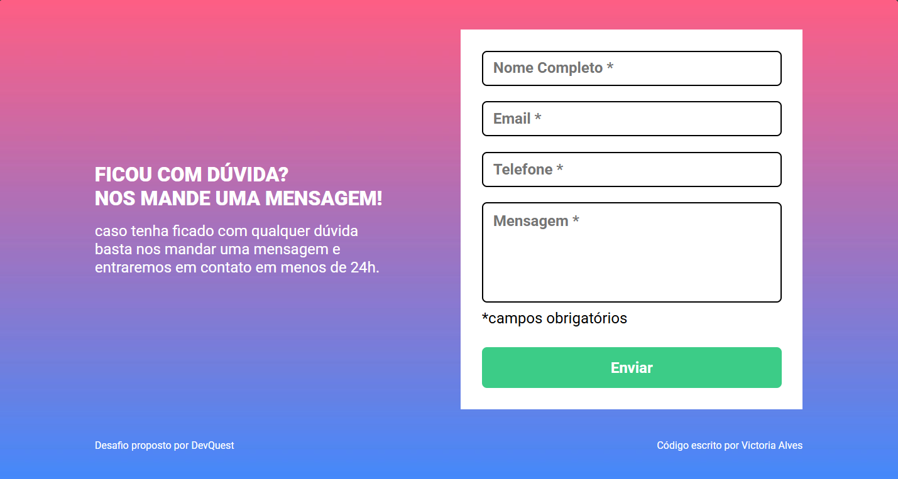
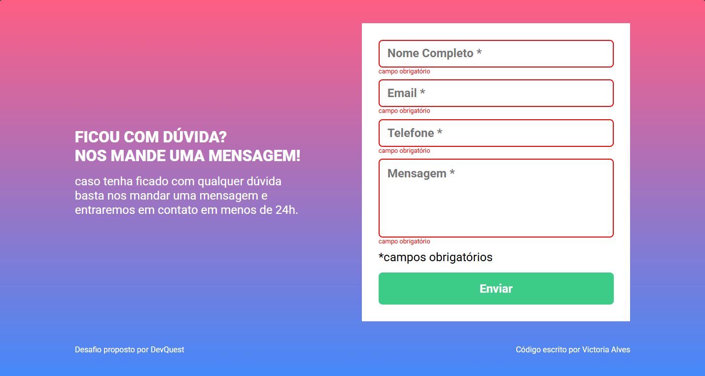
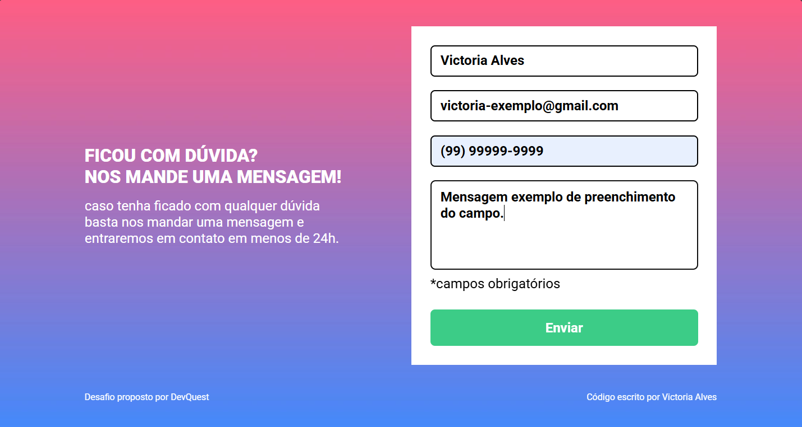
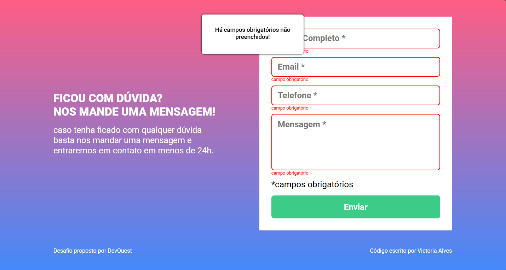
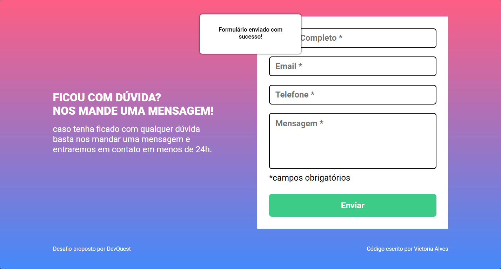

## Quest #2 - Landing Page com Formulário

Este projeto é um desafio proposto pelo curso DevQuest. A tarefa consistia em construir o layout de uma *landing page* usando HTML e CSS, com formulário validado por JavaScript, seguindo o design pré-definido.

## Objetivo do Desafio

Foi proposto a replicação do design apresentado na plataforma Figma, garantindo a visualização da página e validação das interações do formulário, exibindo mensagens de erro de acordo com os campos não preenchidos:

* **HTML Semântico:** Trazendo elementos da linguagem que sejam eficientes e acessíveis para visualização e leitura da página (*screen reading*).
* **Responsividade do formulário:** Permitindo o preenchimento com caracteres adequados e feedback da página para inconsistências no envio, informando quais campos necessitam de atenção.
* **Lógica de JavaScript:** Estruturando toda a funcionalidade do formulário, incluindo a estilização dinâmica, feedback visual das interações e exibição de mensagens caso o processo tenha obtido êxito ou não.
* **CSS Avançado:** Aplicação de ferramentas como Flexbox, além da utilização de variáveis e pseudo-classes

## Tecnologias Utilizadas

| Tecnologia | Finalidade |
| :---: | :---: |
| **HTML5** | Estruturação semântica da página. |
| **CSS3** | Estilização, Flexbox e pseudo-classes. |
| **ECMAScript 2025 (JavaScript)** | Lógica do formulário, estilização dinâmica e exibição de mensagens na tela. |
| **Google Fonts** | Importação da fonte **Roboto**. |

## Screenshots

| Formulário (Padrão) | Formulário (Erro) | Formulário (Preenchido) |
| :---: | :---: | :---: |
|  |  |  |
|  | **Formulário (Aviso Erro)** | **Formulário (Aviso Sucesso)** |
|     |  |  |

## Links

* **Live Site URL:** (https://vickie-alves.github.io/quest2-landing-page-com-formulario/)

## Autor

* **GitHub:** [Victoria Alves](https://github.com/vickie-alves)
